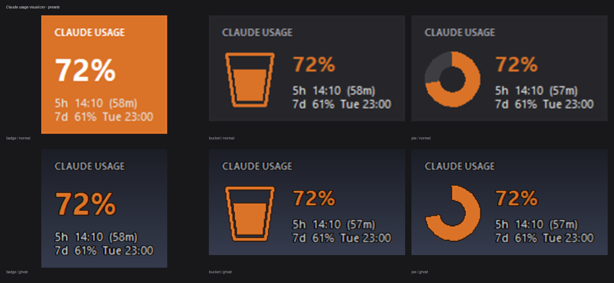
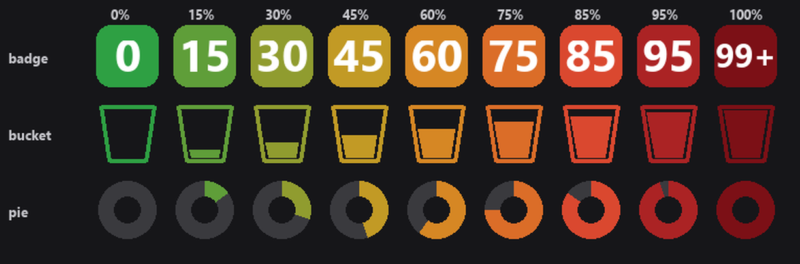
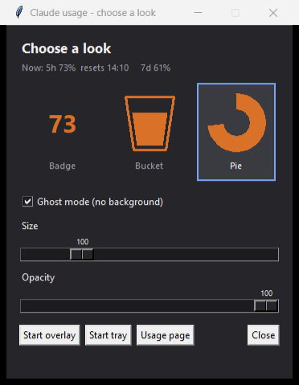

# claude_usage_miniVis

**Am I about to hit my limit?** A glanceable answer, without typing a command.



Shows the **real** numbers — the `rate_limits` Claude Code already sends to your
status line, the same figures your account reports. No token-cost estimation, no
API key, no credentials, no scraping, no network calls of any kind. It reads one
local file and draws a percentage. Zero tokens.

Small on purpose. This is not a dashboard: it answers "is it worth kicking off
this big refactor now, or should I wait for the reset?" and nothing else. The
detail lives in your terminal status line; this is the ambient version.

- **`tray.pyw`** — system-tray / menu-bar icon
- **`overlay.pyw`** — always-on-top badge floating on the desktop
- **`chooser.pyw`** — preview the presets, then start either one

## Status

| | |
|---|---|
| Claude Code | verified against **v2.1.220** |
| Windows 11 | developed and tested |
| macOS / Linux | **written, not yet verified** |
| Python | 3.12 tested |

The statusLine payload is not a documented, stable API. If a Claude Code upgrade
renames a field this degrades to `--` rather than breaking; re-verify with
`probe_statusline.py` and open an issue.

macOS/Linux support is real code — path handling, the launcher script, the Tk
fallbacks — but has not been run on those platforms yet. Ghost mode is
Windows-only by design (see below). Reports and PRs welcome.

## Requires Claude Code

**Install [Claude Code](https://claude.com/claude-code) first, and sign in with a
Pro or Max subscription.** This tool has no data of its own — it only mirrors
what Claude Code hands to its status line, so there is nothing to show until
Claude Code is installed, authenticated and has run at least once.

On an API-key login there are no `rate_limits` at all (that billing has no
subscription windows), and the visualizers will sit at a grey `--`. Same right
after `/clear`, until the session's first response.

**This cannot work for claude.ai in a browser alone.** The only data source is
Claude Code piping JSON into a statusLine command on your machine. With no
Claude Code, there is no local file to mirror — and reading usage out of the
website would mean lifting session cookies or hitting claude.ai with your
credentials. That's deliberately out of scope.

The web UI is still fine as the *display* target — the menu item opens
claude.ai/settings/usage — but the *numbers* come from Claude Code.

## How it works

```
Claude Code ──stdin JSON──> statusline.py ──> ~/.claude/usage-mirror.json ──┬─> tray.pyw
                                 │                                          └─> overlay.pyw
                                 └──> one-line status in the Claude Code UI
```

Fully decoupled: the visualizers never talk to Claude Code, and the statusline
never knows they exist. Any piece can be restarted independently, and you can
run the tray, the overlay, both, or neither.

The mirror stores **only** what gets displayed — the rate limits, model name,
context percentage and Claude Code version. The full payload also carries
`session_id`, `transcript_path`, `cwd` and `cost.total_cost_usd`; none of that
is needed to draw a percentage, and the mirror is exactly the file you'd attach
to a bug report. Pass `--full` in the statusLine command if you want everything
captured for debugging.

## Verified payload shape

Confirmed live against Claude Code **v2.1.220** (not assumed):

```
rate_limits.five_hour.used_percentage    e.g. 58
rate_limits.five_hour.resets_at          unix ts
rate_limits.seven_day.used_percentage    e.g. 59
rate_limits.seven_day.resets_at          unix ts
model.display_name                       e.g. "Opus 5 (1M context)"
context_window.used_percentage           e.g. 5
```

`rate_limits` is **absent** under API-key auth, and absent right after `/clear`
until the session's first API response. Both cases show a grey `--` with an
explanatory tooltip rather than a misleading 0%.

## Install

**Prerequisites:** [Claude Code](https://claude.com/claude-code) installed and
signed in on a Pro/Max subscription, and Python 3. That's it — no account to
create here, no key to paste anywhere.

### Windows

```powershell
git clone https://github.com/kubakubkub/claude_usage_miniVis.git
cd claude_usage_miniVis
python -m venv .venv
.\.venv\Scripts\python.exe -m pip install -r requirements.txt
```

Then double-click **`install-statusline.bat`** — it backs up `settings.json`
with a timestamp and writes only the `statusLine` key. No hand-editing, no jq.

```
install-statusline.bat              install
install-statusline.bat --uninstall  remove the statusLine key
install-statusline.bat --show       print the current setting
install-statusline.bat --force      replace another statusLine without asking
```

Restart Claude Code afterwards.

**Already running a statusLine?** (ccstatusline or similar.) The installer will
show it and ask before replacing — it never overwrites someone else's setup
silently. A timestamped backup is written either way, and `--uninstall` only
removes the key; restoring your previous one means copying it back from that
backup.

### macOS / Linux

```bash
chmod +x claude-usage.sh
./claude-usage.sh setup      # venv + deps
./claude-usage.sh install    # wire up settings.json (backs up first)
./claude-usage.sh overlay    # or: tray
./claude-usage.sh status     # what's running + current numbers
./claude-usage.sh stop
```

The overlay needs only Tkinter (standard library). On Debian/Ubuntu that's
`sudo apt install python3-tk`. The tray additionally needs pystray + Pillow,
and PyObjC on macOS — all handled by `setup`.

## Run (Windows)

| Double-click | Does |
|---|---|
| `start-tray.bat` | tray icon |
| `stop-tray.bat` | stop it |
| `start-overlay.bat` | floating desktop badge |
| `stop-overlay.bat` | stop it |

All four refuse to double-start and print a clear error if the venv is missing.

### Start at login

Not installed automatically — run it yourself:

```powershell
powershell -ExecutionPolicy Bypass -File .\make-startup-shortcut.ps1            # tray
powershell -ExecutionPolicy Bypass -File .\make-startup-shortcut.ps1 -Overlay   # overlay
```

Undo with `-Remove`, or delete the `.lnk` from `shell:startup` (Win+R).

The shortcut points at `pythonw.exe` directly, so nothing flashes on screen.
The `.bat` files briefly show a console; the shortcut doesn't.

## What it looks like


Three presets, each in normal and ghost mode. All six are real captures at the
same moment, so the numbers match across them.

Tray icons across the range — the colour is a continuous ramp, not fixed bands:



## The chooser



Double-click **`choose.bat`** (or `./claude-usage.sh choose`) to preview all
three presets side by side, drawn with the same code the live widget uses and
with your real current usage. Picking one applies immediately, so anything
already running updates while you watch.

From there you can start the overlay or the tray directly — it goes through the
normal launchers, so it still won't start a second copy.

Put **`chooser.pyw`** in Startup instead of a visualizer if you'd rather pick a
look each session than have one restored:

```powershell
powershell -ExecutionPolicy Bypass -File .\make-startup-shortcut.ps1 -Chooser
```

## Three presets

Pick from the **right-click menu → Style**, on either the tray icon or the
overlay, or from the chooser. The choice is shared — all of them switch
together, live, no restart — and saved to `~/.claude/usage-visualizer.json`.

| Preset | Looks like |
|--------|-----------|
| `badge` | flat tile, percentage as a big number |
| `bucket` | tapered pail that fills up as usage climbs |
| `pie` | round donut dial sweeping clockwise from 12 o'clock |

Every preset is labelled **CLAUDE USAGE** on the overlay — a filling bucket next
to a clock reads as a battery indicator otherwise.

Note the trade-off in the *tray*: `badge` is the only preset showing a readable
number at 16×16. `bucket` and `pie` convey the fraction by shape instead; the
exact number is in the tooltip.

## The overlay

A frameless widget showing the 5-hour percentage, with the 7-day window and
reset times underneath.

- **Drag** it anywhere — the position is saved
- **Double-click** opens the usage page
- **Right-click** for: open usage page, style, ghost mode, appearance, reset
  position, quit

### Appearance

Right-click → **Appearance...** opens sliders:

| Control | Range | Effect |
|---------|-------|--------|
| Size | 60%–250% | scales fonts, graphic and padding together |
| Opacity | 25%–100% | whole-widget translucency |
| Ghost mode | on/off | removes the panel entirely |

Values are clamped on read as well as write, so a hand-edited config can't
produce a 4000-pixel widget or an invisible one.

### Ghost mode

Drops the background completely — only the figure and text float on the
desktop, with the usage colour carried by the drawing itself:

- **badge** — no tile; the number itself takes the colour
- **bucket** — unchanged (it was always just an outline plus its fill level)
- **pie** — the grey track ring disappears, leaving only the used arc

Two caveats worth knowing:

- **Windows only.** It works by chroma-keying `#010203` to transparent via
  `-transparentcolor`, which Tk only supports on Windows. Elsewhere it falls
  back to the normal dark panel and the settings window says so.
- **Transparent pixels are click-through.** Grab the figure or the text to drag
  it; empty space passes clicks to whatever is underneath.
- **Text picks up a faint dark halo.** Colour-key transparency is all-or-nothing
  per pixel, so anti-aliased glyph edges — blended against the key colour —
  stay put as a thin fringe. Visible in the ghost screenshots above. Inherent to
  the technique, not a bug that can be tuned out.

It stays out of the taskbar and the Alt-Tab list, and clamps itself back on
screen if your display layout changes.

## Colours

A **continuous** ramp driven by the 5-hour window — every percentage point gets
its own shade, so 98% reads visibly darker than 90% rather than both flattening
to the same red. Anchor points (`COLOR_STOPS` in `usage_core.py`):

| Usage | Colour | Hex |
|-------|--------|-----|
| 0% | green | `#2ea043` |
| 50% | amber | `#d29922` |
| 75% | orange | `#db6d28` |
| 90% | red | `#da3633` |
| 100% | dark red | `#7c1016` |
| stale / unknown | grey | `#6e6e6e` |

Everything between is interpolated: 93% `#c72e2d`, 95% `#ab2324`, 98% `#8f181c`.
Edit `COLOR_STOPS` to reshape the ramp; both visualizers follow it.

"Stale" = the mirror file is older than 10 minutes, i.e. Claude Code hasn't
rendered a status line recently. The last known numbers stay visible, greyed
and marked `STALE`, rather than vanishing.

## Reset times

Both show the wall-clock reset time so you don't do the arithmetic, with the
countdown alongside:

```
   61%
5h  14:10  (1h 33m)
7d  60%  Tue 23:00
```

Format adapts to distance: `14:10` today, `Tue 23:00` within the week,
`03 Aug 12:34` beyond that.

> `resets_at` is when the *current* window rolls over, not "now plus the window
> length." A 7-day window sitting at 82h left is normal — it started ~3.6 days
> ago.

## Files

| File | Purpose |
|------|---------|
| `statusline.py` | Claude Code statusLine: mirrors payload, prints status line |
| `usage_core.py` | Shared reading/formatting/colour/style logic |
| `usage_tk.py` | Shared Tk canvas drawing (overlay + chooser previews) |
| `tray.pyw` | Tray / menu-bar icon (pystray + Pillow) |
| `overlay.pyw` | Floating desktop badge (Tkinter only) |
| `chooser.pyw` | Preset picker with live previews (Tkinter only) |
| `choose.bat` | Double-click to open the chooser |
| `install_statusline.py` | Safe settings.json editor (backup + atomic write) |
| `install-statusline.bat` | Windows wrapper for the above |
| `claude-usage.sh` | macOS/Linux launcher for everything |
| `start/stop-*.bat` | Windows launchers |
| `make-startup-shortcut.ps1` | Creates/removes the Startup shortcut |
| `probe_statusline.py` | Re-verify the payload shape after a Claude Code upgrade |

## If the schema changes after an upgrade

Point `statusLine.command` at `probe_statusline.py`, let it capture a few
renders into `probe-dump.jsonl`, inspect it, then run `install-statusline.bat`
to switch back. The probe writes a dump and nothing else.

## Notes

- `ANTHROPIC_API_KEY` is never read or set by any file here. Setting it would
  reroute Claude Code to paid API billing and blank out `rate_limits` entirely.
- `statusline.py` cannot crash the status line: every failure path degrades to
  a plain string, and a traceback is never printed to stdout.
- Mirror and settings writes are atomic (temp file + `os.replace`), so nothing
  can read or leave a half-written file.
- On Windows, one running visualizer shows as **two** `pythonw.exe` processes.
  That's normal — the venv's `pythonw.exe` is a redirector stub that runs the
  base interpreter as a child. There's still only one icon.
