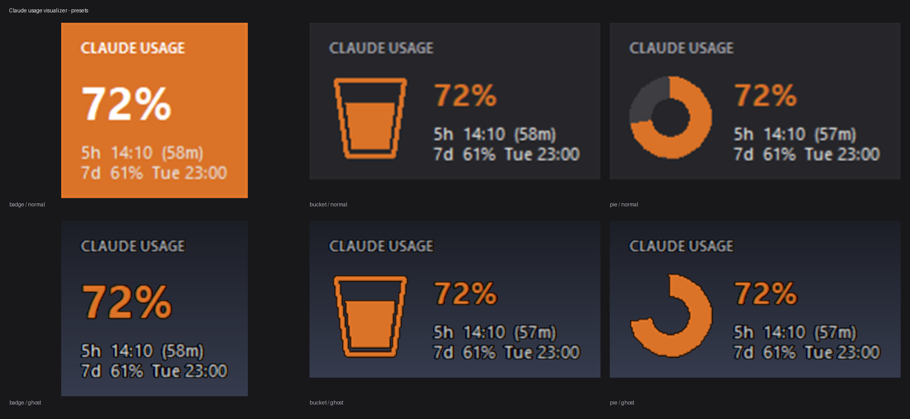

# claude_usage_miniVis

Am I about to hit my Claude limit? A small tray icon and desktop widget that
answer that at a glance.



It shows the real numbers, the same `rate_limits` Claude Code already sends to
your status line. No API key, no login, no network calls, no tokens: it only
reads files Claude Code leaves on your disk.

It also learns what your Workflow runs and subagents usually cost, and warns you
when one won't fit before the reset.

## You need

- [Claude Code](https://claude.com/claude-code), signed in with a Pro or Max
  subscription (an API-key login has no usage limits to show)
- Python 3

## Install

**Windows**

```powershell
git clone https://github.com/kubakubkub/claude_usage_miniVis.git
```

Then, in the `windows` folder, double-click:

1. `setup.bat` to install
2. `install-statusline.bat` to connect it to Claude Code (it backs up your
   settings first, and asks before replacing another status line)
3. `start-overlay.bat` for the desktop widget, or `start-tray.bat` for the tray
   icon. `choose.bat` lets you preview the looks first.

Restart Claude Code, and the numbers show up after its next reply.

To start it with Windows:
`powershell -ExecutionPolicy Bypass -File .\windows\make-startup-shortcut.ps1`
(add `-Overlay` for the widget, `-Remove` to undo).

**macOS**

In the `macos` folder, double-click `Setup.command`, then
`Install-Statusline.command`, then `Start-Tray.command`. `Status.command` prints
the current numbers, and `Stop.command` stops the icon.

On a Mac you get the menu-bar icon, not the desktop widget: Apple's built-in
Python can't draw it. Details in [macOS notes](docs/details.md#macos-notes).

**Linux** should work through `macos/claude-usage.sh`, but I haven't tried it.

## Using it

The widget shows your 5-hour usage, with the 7-day window and reset times under
it. The colour goes from green to dark red as you fill up.

- **Drag** it anywhere. **Double-click** opens your usage page on claude.ai.
- **Hover** for the full picture.
- The **arrow** in the corner folds it down to one line and back.
- **Right-click** for the style (badge, bucket or pie), ghost mode (no
  background), size and opacity.

The tray icon has the same styles and puts the details in its tooltip.

### Will this run fit?

Pick a run type under **right-click → Estimate for**, and the widget tells you
whether one still fits: `✓ workflow ~16% fits`, `⚠ workflow 16-47% tight`, or
`⚠ workflow: wait for 20:40`. It learns this from your own history in the
background, so it's rough for the first few days.

If the last hour's pace would fill your 5-hour window before the reset, you get
a warning like `↗ full ~15:20`.

For the full breakdown, run `windows\usage-report.bat` (or
`Usage-Report.command` on a Mac).

## Good to know

- **Numbers only update while Claude Code is running.** There's no other way to
  get them without your login details. In between, it shows the last numbers,
  faded after 10 minutes, and switches to 0% once a window has reset.
- **Use on claude.ai counts toward your limits but isn't visible here.**
- **Nothing leaves your computer.** Everything it reads and writes stays in
  `~/.claude`.
- **Ghost mode is Windows-only.**

More on how it works, the colours, the learner and platform quirks is in
[docs/details.md](docs/details.md).

## Contributing

Issues and PRs are welcome. If you fork it, run
`git config core.hooksPath .githooks` once. It turns on a pre-push check that
stops keys and personal paths from being pushed by accident.

MIT licensed.
